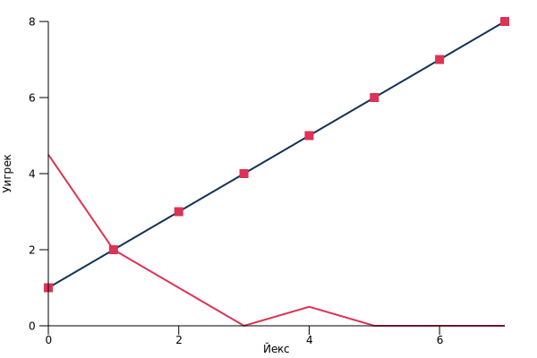
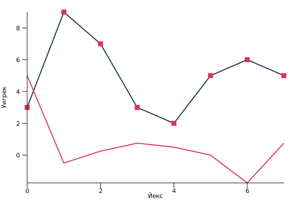

# wavelet-integration

### Linear
``` bash
Input:
[1.0, 2.0, 3.0, 4.0, 5.0, 6.0, 7.0, 8.0]
Straight transformation:
[1.5, 3.5, 5.5, 7.5, 0.5, 0.5, 0.5, 0.5]
[2.5, 6.5, 1.0, 1.0, 0.5, 0.5, 0.0, 0.0]
[4.5, 2.0, 1.0, 0.0, 0.5, 0.0, 0.0, 0.0]
Inverse  transformation:
[2.5, 1.0, 0.5, 0.0, 6.5, 1.0, 0.5, 0.0]
[1.5, 0.5, 3.5, 0.5, 5.5, 0.5, 7.5, 0.5]
[1.0, 2.0, 3.0, 4.0, 5.0, 6.0, 7.0, 8.0]
```


### Random

``` bash
Input:
[5.0, 4.0, 0.0, 7.0, 6.0, 8.0, 7.0, 3.0]
Straight transformation:
[4.5, 3.5, 7.0, 5.0, -0.5, 3.5, 1.0, -2.0]
[4.0, 6.0, -0.5, -1.0, 1.5, -0.5, 2.0, -1.5]
[5.0, 1.0, -0.75, -0.25, 0.5, -1.0, 0.25, -1.75]
Inverse  transformation:
[4.0, -0.5, 1.5, 2.0, 6.0, -1.0, -0.5, -1.5]
[4.5, -0.5, 3.5, 3.5, 7.0, 1.0, 5.0, -2.0]
[5.0, 4.0, 0.0, 7.0, 6.0, 8.0, 7.0, 3.0]
```

